University of Pennsylvania, CIS 565: GPU Programming and Architecture, Project 4 CUDA Rasterizer
======================
* Ziyu Li
* Tested on: Windows 7, Intel Core i7-3840QM @2.80GHz 16GB, Nvidia Quadro K4000M 4GB

## Features
#### All Features
 - All Basic Graphics Pipeline
	 - Vertex Shading
	 - Primitive assembly with support for triangles read from buffers of index and vertex data.
	 - Rasterization
	 - Fragment shading
	 - Depth Buffer and Depth Test
	 - Lambert and Blinn shading Model
 - Other Features
	 - High Precision Float z buffer
	 - Screen Space Ambient Occlusion (SSAO)
	 - Super-Sampling Anti Aliasing (SSAA)
	 - Tile-Based Pipeline
	 - Back-face Culling
	 - Display Wire-frame / Points with line width and point size adjustment
	 - UV Texture Mapping with Perspective Correction
	 - Bilinear Texture Filter
	 - Toon Shading
	 - Bloom (Still has some bugs...)

For better result, all the images demonstrate below are using SSAA 2x

#### Shading Models
| Lambert | Blinn |
| ----- | ----- |
| 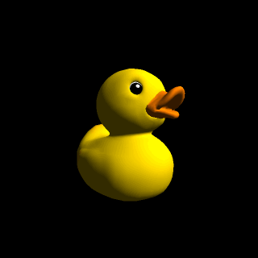 | 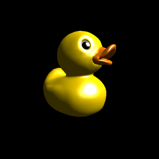 |

#### Tile-Based Pipeline

+[tile_imp](img/tile_imp.png)
(Image from *OpenGLInsights, TileBasedArchitectures*)

Break framebuffer into several tiles, and render one tile per thread instead of one primitive per thread.

| Primitive-Based | Tile-Based |
| ----- | ----- |
| 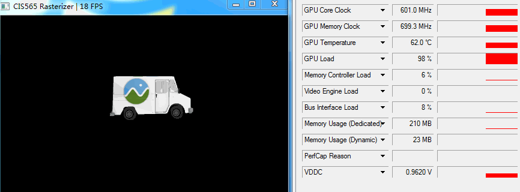 | 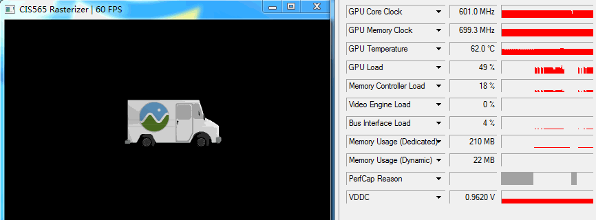 |

By using the Tile-Based Pipeline, the interaction is much smoother and GPU Load is siginificant reduced. 

For details performance comparison, please check *Performance* Section. 

#### Back-face Culling

The rasterizer will neglect such triangles which are not facing to the camera (eye).

| No Culling | Back-face Culling |
| ----- | ----- |
|  | 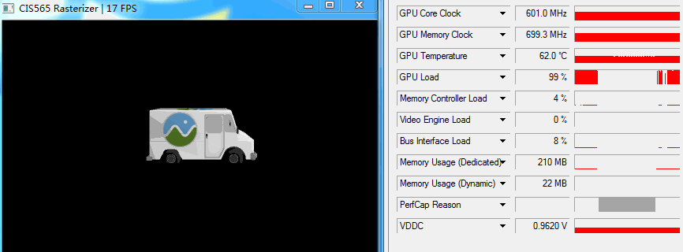 |

For details performance comparison, please check *Performance* Section. 

#### Display Wire-frame / Points
| Solid | Wire-frame | Points|
| ----- | ----- | ----- |
| 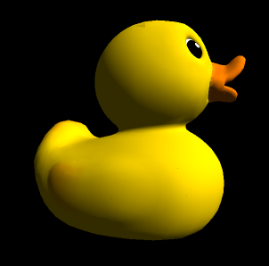 | 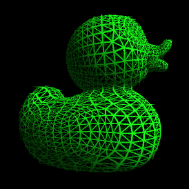 | 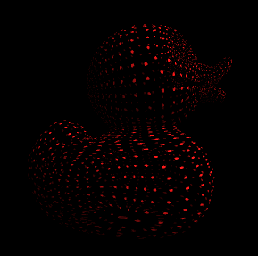 | 

#### UV Texture Mapping with Perspective Correction

| Wrong | Correct|
| ----- | ----- |
| 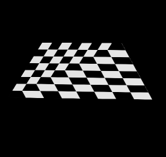 | 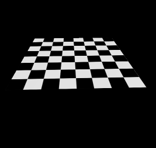 |

#### Bilinear Texture Filter

| No Filter | Bilinear Filter |
| ----- | ----- |
|  |  |

#### Screen Space Ambient Occlusion (SSAO)

| No AO | SSAO | SSAO Pass |
| ----- | ----- | ----- |
| 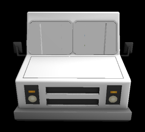 | 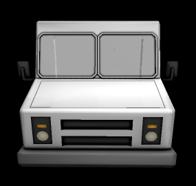 | 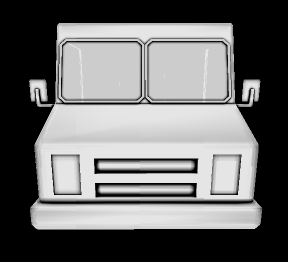 |

Given any pixel in the scene, it is possible to calculate its ambient occlusion by treating all neighboring pixels as small spheres, and adding together their contributions. 
The occlusion can be contributed by distance to occludee and angle between occludee's normal and occluder.

+[ao](img/ao.jpg)
(Image from *A Simple and Practical Approach to SSAO* https://www.gamedev.net/articles/programming/graphics/a-simple-and-practical-approach-to-ssao-r2753/)

Because we need a random direction of occlusion ray. A cached or per-generated noise texture is necessary. If the SSAO feature is turn on a 16x16 noise texture will be generate rasterizer after the primitive has loaded.

This screenshot below, shows the AO Pass of the model.

**SSAO Pass Render**
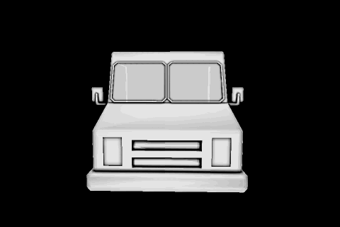

#### Super-Sampling Anti Aliasing (SSAA)

| No AA | SSAA x2 | SSAA x4|
| ----- | ----- | ----- |
|  |  |  | 

#### Toon Shading
| Orignal | Toon Shading |
| ----- | ----- |
|  |  |

#### Bloom (BUGGE......)

There are still something not corrected yet. But the basic idea is to blend the framebuffer with different amount of blur.

| Orignal | Bloom |
| ----- | ----- |
|  | 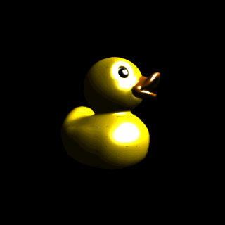 |

##Performance
#### Tile-Based Pipeline

### References
* [Blinn Shading](https://en.wikipedia.org/wiki/Blinn%E2%80%93Phong_shading_model)
* [SSAO](https://www.gamedev.net/articles/programming/graphics/a-simple-and-practical-approach-to-ssao-r2753/)
* [Back-Face Culling](https://en.wikipedia.org/wiki/Back-face_culling)
* [Kernel Filter](https://www.slideshare.net/DarshanParsana/gaussian-image-blurring-in-cuda-c)

### Credits
* [factomicMin](https://devtalk.nvidia.com/default/topic/492068/atomicmin-with-float/) by [@hyqneuron]()
* [tinygltfloader](https://github.com/syoyo/tinygltfloader) by [@soyoyo](https://github.com/syoyo)
* [glTF Sample Models](https://github.com/KhronosGroup/glTF/blob/master/sampleModels/README.md)
