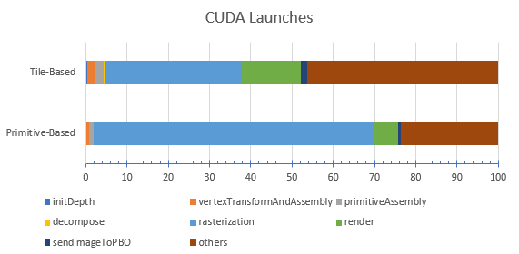

University of Pennsylvania, CIS 565: GPU Programming and Architecture, Project 4 CUDA Rasterizer
======================
* Ziyu Li
* Tested on: Windows 7, Intel Core i7-3840QM @2.80GHz 16GB, Nvidia Quadro K4000M 4GB

## Features
#### All Features
 - All Basic Graphics Pipeline
	 - Vertex Shading
	 - Primitive assembly with support for triangles read from buffers of index and vertex data.
	 - Rasterization
	 - Fragment shading
	 - Depth Buffer and Depth Test
	 - Lambert and Blinn shading Model
 - Other Features
	 - Screen Space Ambient Occlusion (SSAO)
	 - Super-Sampling Anti Aliasing (SSAA)
	 - Tile-Based Pipeline
	 - Back-face Culling (optimized using stream compaction)
	 - Display Wire-frame / Points with line width and point size adjustment
	 - UV Texture Mapping with Perspective Correction
	 - Bilinear Texture Filter
	 - Toon Shading


For better result, all the images demonstrate below are using SSAA 2x

#### Shading Models

| Lambert | Blinn |
| ----- | ----- |
|  |  |

To switch the shading model to Blinn, change the *BLINN* to 1
```c++
 #define BLINN 1
```

#### Tile-Based Pipeline


(Image from *OpenGLInsights, TileBasedArchitectures*)

Break framebuffer into several tiles, and render one tile per thread instead of one primitive per thread.

| Primitive-Based | Tile-Based |
| ----- | ----- |
|  |  |

By using the Tile-Based Pipeline, the interaction is much smoother and GPU Load is siginificant reduced. 

To switch the pipeline to tile-based, change the *TILE_BASED_RENDER* to 1
```c++
 #define TILE_BASED_RENDER 1
```

For details performance comparison, please check *Performance* Section. 

#### Back-face Culling

Remove the triangles which are not facing to the camera(eye) before rasterization.

| Only Front Face | Only Back Face |
| ----- | ----- |
|  |  |

Here is the Back-face Culling performance comparision in Primitive-Based Pipeline.

| No Culling | Back-face Culling |
| ----- | ----- |
|  |  |


To toggle the backface culling, change the *BACKFACE_CULLING* to 1
```c++
 #define BACKFACE_CULLING 1
```

For details performance comparison, please check *Performance* Section. 

#### Display Wire-frame / Points

| Solid | Wire-frame | Points|
| ----- | ----- | ----- |
|  |  |  | 

To switch different mode of display, change the *SHADING* to 1 for rendering wireframe and 2 for rendering vertices
```c++
 #define SHADING 1 // 0: Solid, 1: Wireframe, 2: Vertices
```

#### UV Texture Mapping with Perspective Correction

| Wrong | Correct|
| ----- | ----- |
|  |  |

#### Bilinear Texture Filter

| No Filter | Bilinear Filter |
| ----- | ----- |
|  |  |

To toggle the bilinear texture filter, change the *BILINEAR_INTERP* to 1
```c++
 #define BILINEAR_INTERP 1
```

#### Screen Space Ambient Occlusion (SSAO)

| No AO | SSAO | SSAO Pass |
| ----- | ----- | ----- |
|  |  |  |

Given any pixel in the scene, it is possible to calculate its ambient occlusion by treating all neighboring pixels as small spheres, and adding together their contributions. 
The occlusion can be contributed by distance to occludee and angle between occludee's normal and occluder.


(Image from *A Simple and Practical Approach to SSAO* https://www.gamedev.net/articles/programming/graphics/a-simple-and-practical-approach-to-ssao-r2753/)

Because we need a random direction of occlusion ray. A cached or per-generated noise texture is necessary. If the SSAO feature is turn on a 16x16 noise texture will be generate rasterizer after the primitive has loaded.

This screenshot below, shows the AO Pass of the model.


To toggle the SSAO, change the *SSAO* to 1
```c++
 #define SSAO 1
```

#### Super-Sampling Anti Aliasing (SSAA)

| No AA | SSAA x2 | SSAA x4|
| ----- | ----- | ----- |
|  |  |  | 

To toggle the SSAA, change the *SSAA* to 1
```c++
 #define SSAA 1
```

#### Toon Shading

| Orignal | Toon Shading |
| ----- | ----- |
|  |  |

To toggle the Toon Shading, change the *TOON* to 1
```c++
 #define TOON 1
```

#### Bloom (BUGGE......)

There are still something not corrected yet. But the basic idea is to blend the framebuffer with different amount of blur.

| Orignal | Bloom |
| ----- | ----- |
|  |  |

To toggle the Bloom Effect, change the *BLOOM* to 1
```c++
 #define BLOOM 1
```

##Performance
#### Tile-Based Pipeline

The benchmark is based on test model *CesiumMilkTruck* and use SSAA 2x feature.
And the results of graphics card gpu load and memory usage is recorded on GPU-Z.


Based on the result, the Tile-Based Pipeline reduces the GPU load and increases the framerate. It is much more efficient than Primitive-Based Pipeline, especially when less triangle occupy the the most of screen.

#### BackFace Culling


The backface culling slightly increase the preformance under some scenarios, but it does not affect the performance when a triangle is almost occupy the screen.

#### Runtime Analysis




Based on the CUDA Device Functions, rasterization is the bottleneck and most intense function in the whole program. 
For the primitive-based pipeline, the reason of that could caused by too much calculation redundancy and extremely unbalance the job schedualing to rasterize triangles. However, for the tile-based pipeline, There are some empty tiles which within the bounding box but outside the triangle still occupy the runtime of the kernel function. So I believe one of the optimization can be do a triangle-tile intersection test and use stream compaction to remove the empty tiles.

| CUDA Device Functions      | Primitive-Based (%)| Tile-Based (%)|
|----------------------------|-----------------|------------|
| initDepth                  | 0.2             | 0.4        |
| vertexTransformAndAssembly | 0.7             | 1.7        |
| primitiveAssembly          | 0.9             | 2.2        |
| decompose                  | N/A             | 0.5        |
| rasterization              | 68.2            | 33.1       |
| render                     | 5.7             | 14.2       |
| sendImageToPBO             | 0.6             | 1.6        |
| others                     | 23.7            | 46.3       |


| CUDA Runtime API      | Primitive-Based (%)| Tile-Based (%)|
|-----------------------|-----------------|------------|
| cudaFree              | 5.87            | 6.96       |
| cudaMalloc            | 0.44            | 0.52       |
| cudaMemset            | 0.11            | 0.34       |
| cudaMemcpy            | 0.27            | 0.31       |
| cudaLaunch            | 1.21            | 3.47       |
| cudaDeviceSynchronize | 83.85           | 70.4       |
| others                | 8.25            | 18         |

### References
* [Blinn Shading](https://en.wikipedia.org/wiki/Blinn%E2%80%93Phong_shading_model)
* [SSAO](https://www.gamedev.net/articles/programming/graphics/a-simple-and-practical-approach-to-ssao-r2753/)
* [Back-Face Culling](https://en.wikipedia.org/wiki/Back-face_culling)
* [Kernel Filter](https://www.slideshare.net/DarshanParsana/gaussian-image-blurring-in-cuda-c)

### Credits
* [factomicMin](https://devtalk.nvidia.com/default/topic/492068/atomicmin-with-float/) by [@hyqneuron]()
* [tinygltfloader](https://github.com/syoyo/tinygltfloader) by [@soyoyo](https://github.com/syoyo)
* [glTF Sample Models](https://github.com/KhronosGroup/glTF/blob/master/sampleModels/README.md)
* [gpu-z](https://www.techpowerup.com/gpuz/) by [@TechPowerUp](https://www.techpowerup.com/)
